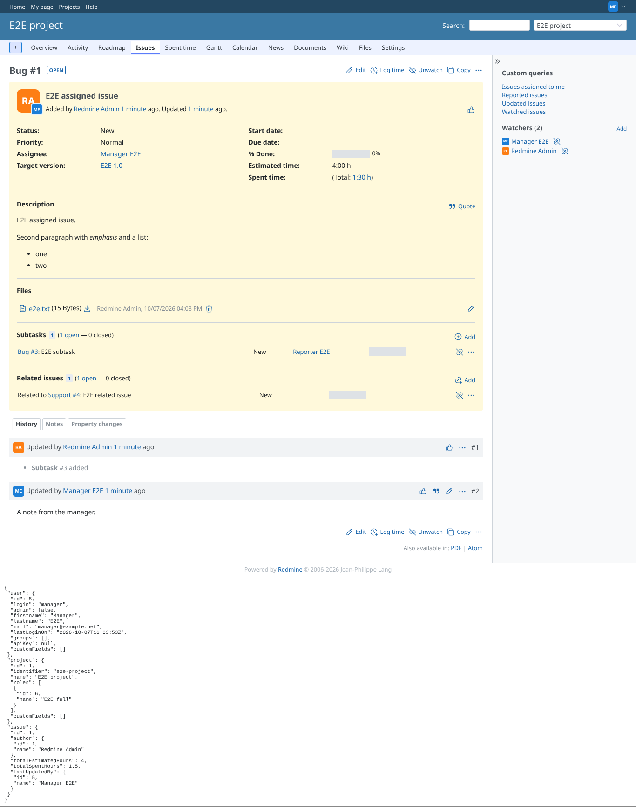
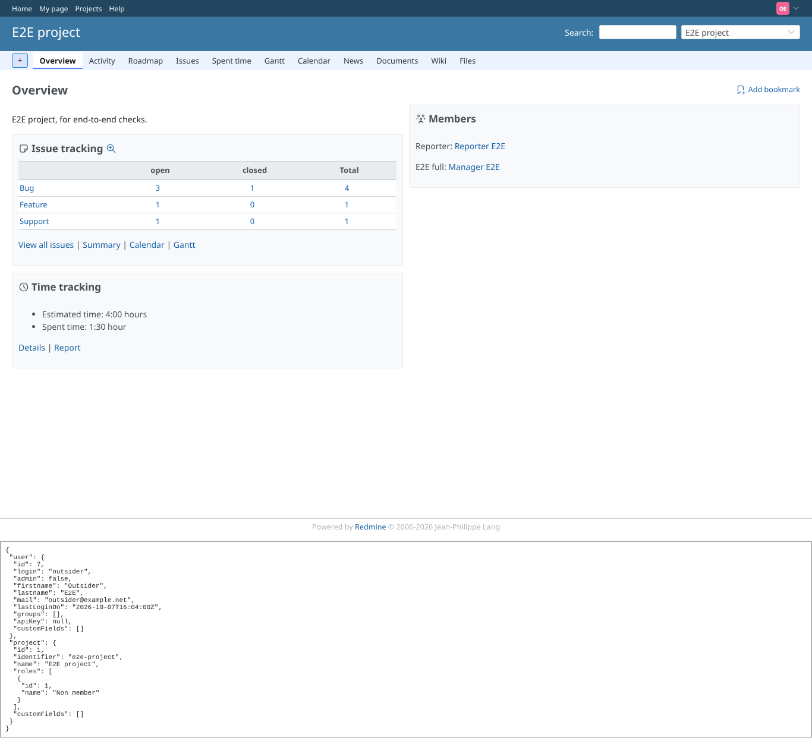
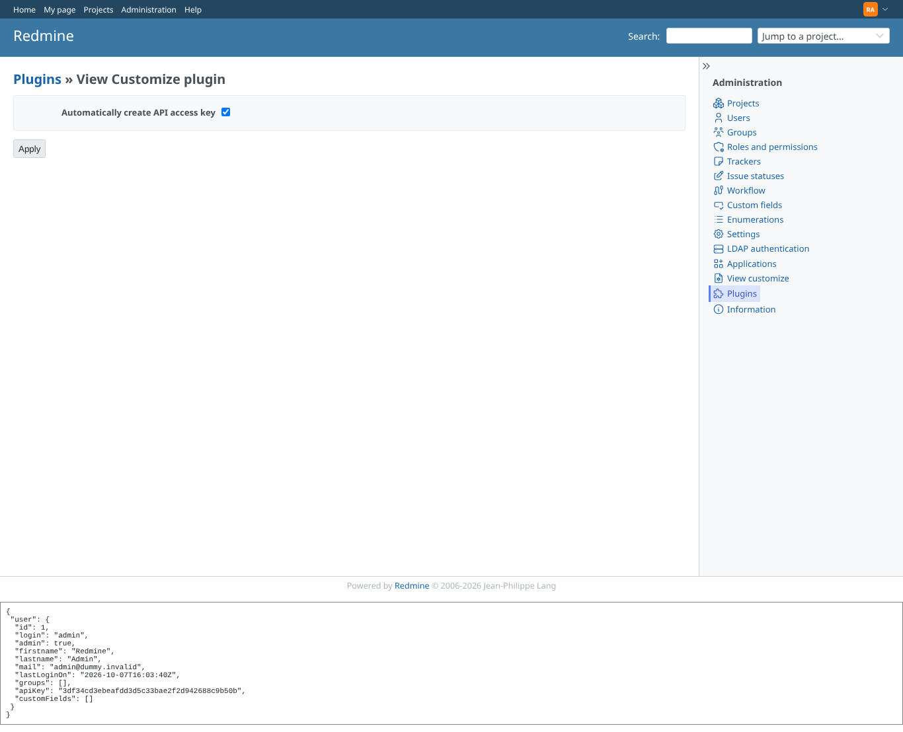
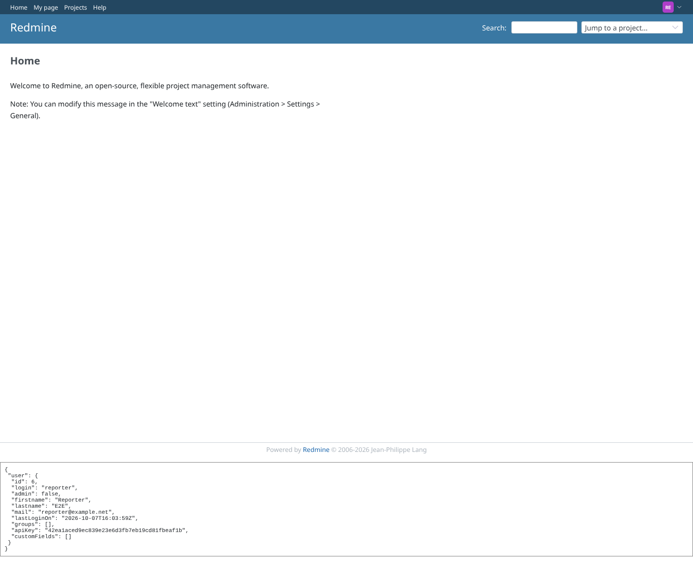

# context

Run 2026-10-07T16:04:25.427Z against http://127.0.0.1:3000.

| screenshot | user | URL | shows |
|---|---|---|---|
|  | manager | `/issues/1` | manager on an issue: user, project (with roles) and issue context, no API key (setting off) |
|  | outsider | `/projects/e2e-project` | outsider on a public project: roles = Non member |
|  | admin | `/settings/plugin/view_customize` | admin: "Automatically create API access key" saved as ON |
|  | reporter | `/` | reporter: with the setting on the context carries an API key (created on this very request) |
