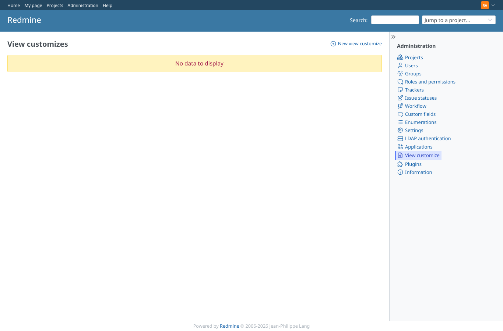
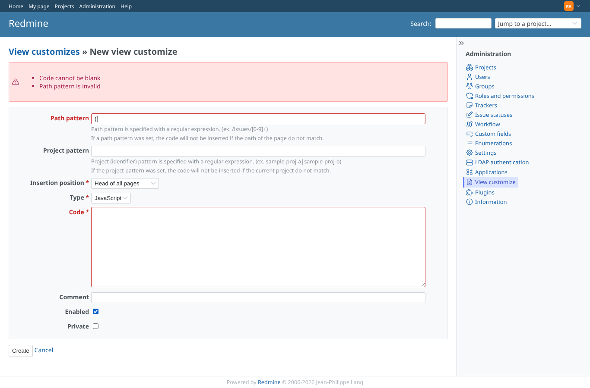
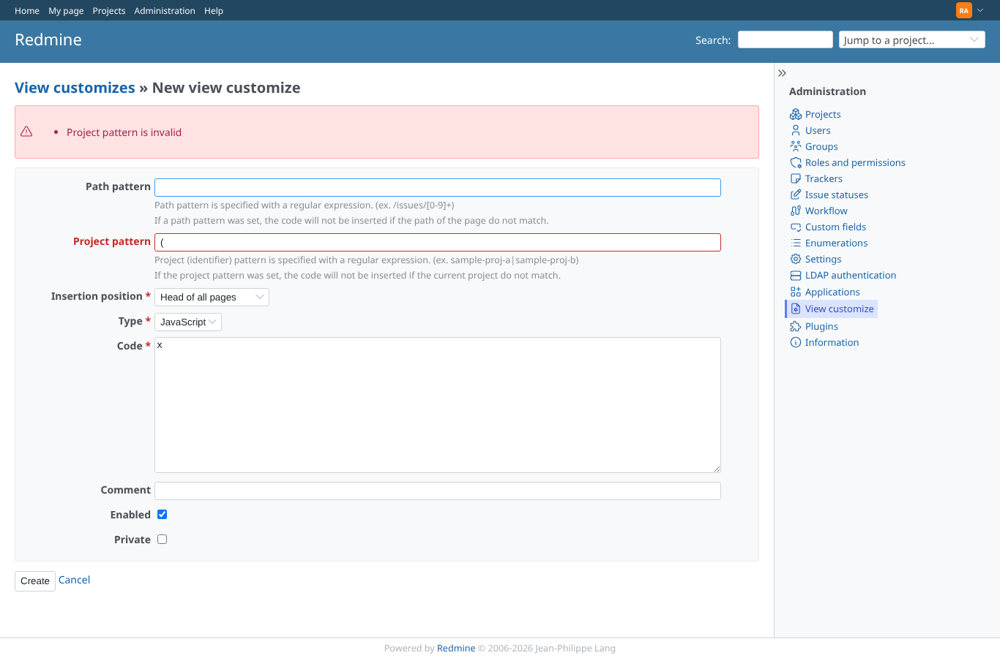
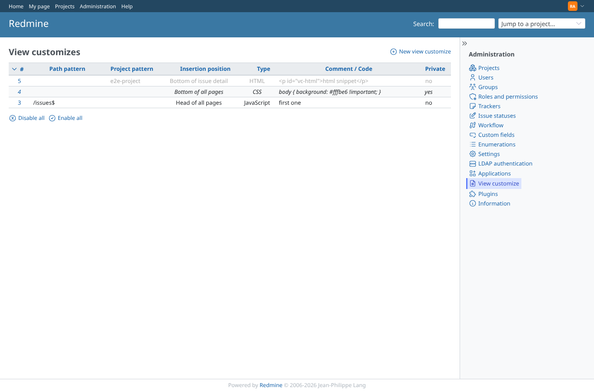
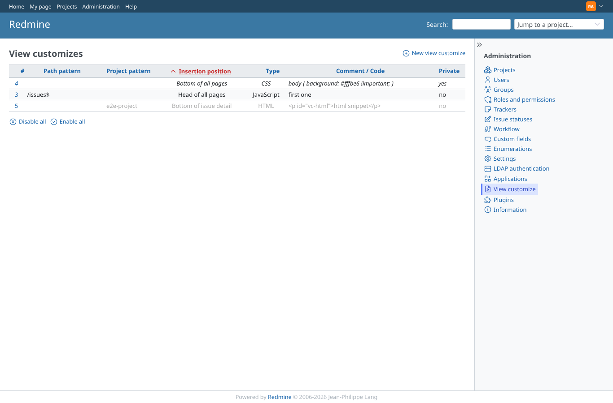
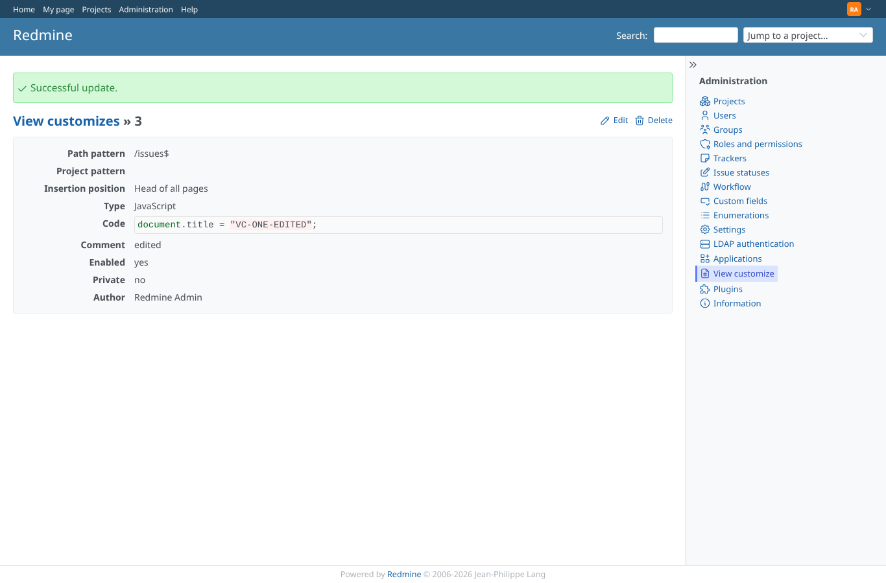
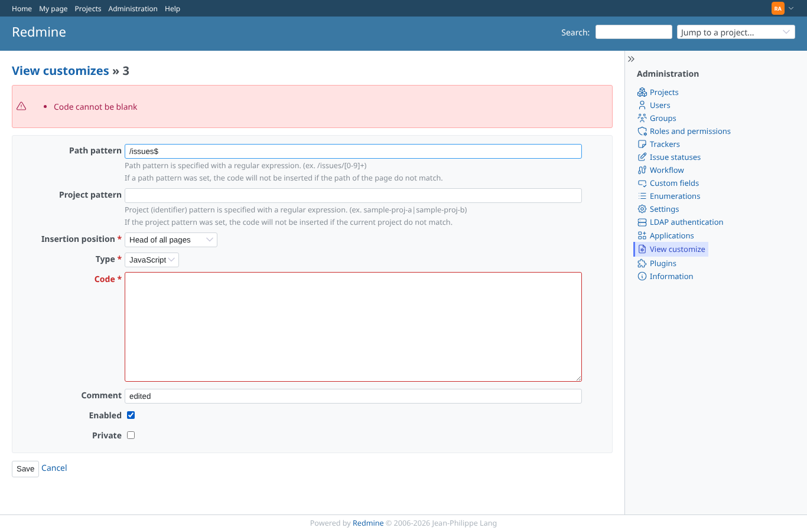
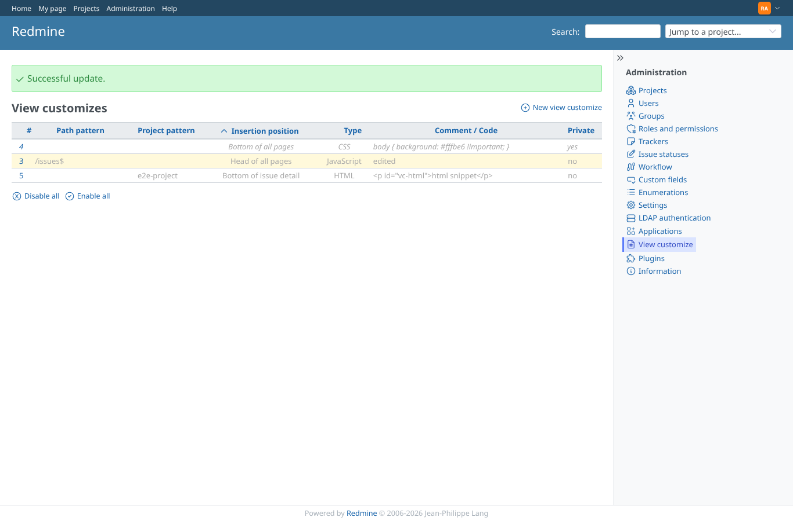
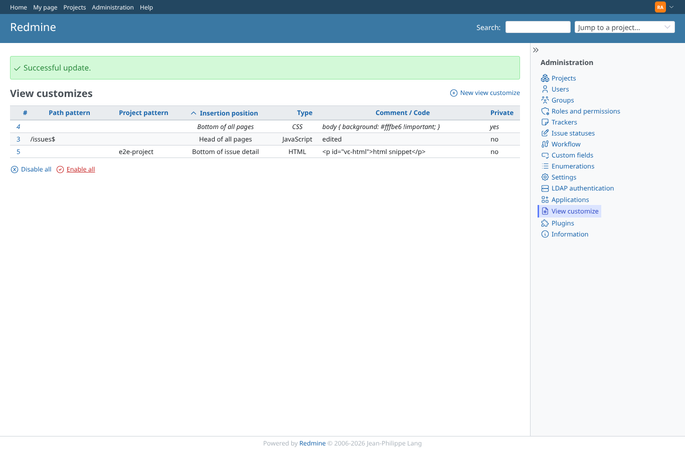
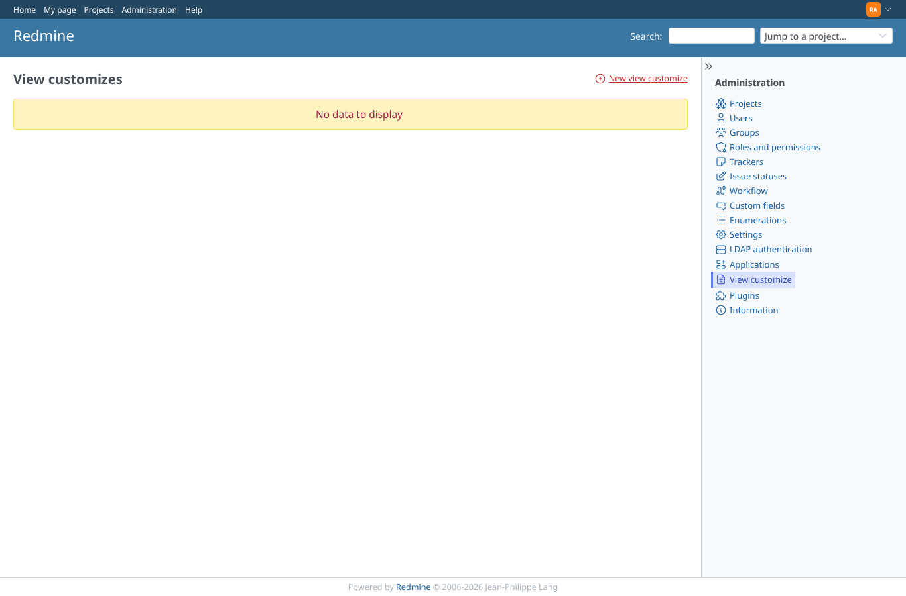

# crud

Run 2026-10-06T19:45:31.804Z against http://127.0.0.1:3000.

| screenshot | user | URL | shows |
|---|---|---|---|
|  | admin | `/view_customizes` | Empty list shows the "no data" notice, no stray application menu |
|  | admin | `/admin` | The administration page lists "View customize" with its SVG icon |
|  | admin | `/view_customizes` | Blank code and a broken regular expression are refused with errors |
|  | admin | `/view_customizes` | A broken project pattern is refused |
|  | admin | `/view_customizes/3` | After create: show page with the highlighted code and a success notice |
|  | admin | `/view_customizes` | List: comment when present, else the code; disabled/private rows marked |
|  | admin | `/view_customizes?sort=insertion_position%2Cid%3Adesc` | List sorted by insertion position |
|  | admin | `/view_customizes/3` | After update: the new code is shown |
|  | admin | `/view_customizes/3` | Update with blank code is refused with an error |
|  | admin | `/view_customizes` | After "Disable all" every row is marked disabled |
|  | admin | `/view_customizes` | After "Enable all" no row is disabled |
|  | admin | `/view_customizes` | After deleting all three the list is empty again |
|  | admin | `/view_customizes/99999` | An unknown id gives a 404 page |
