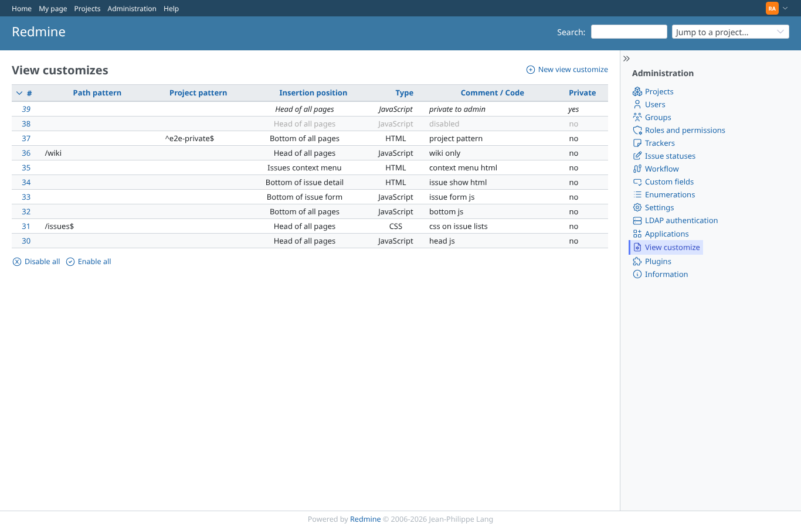
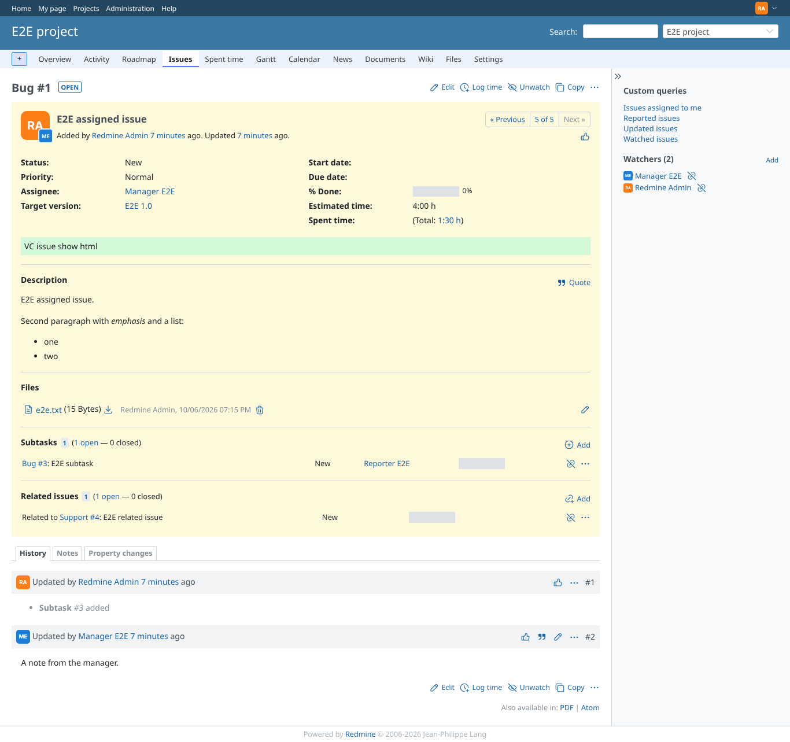
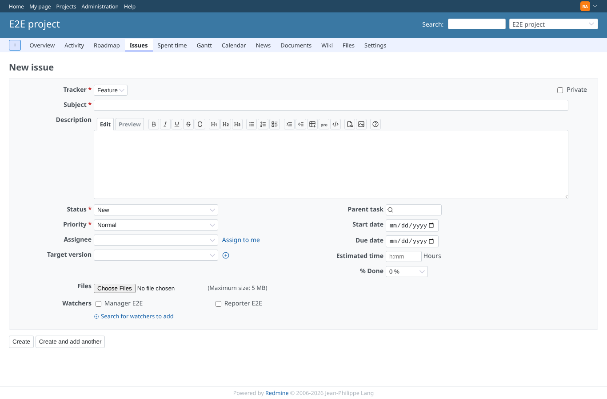
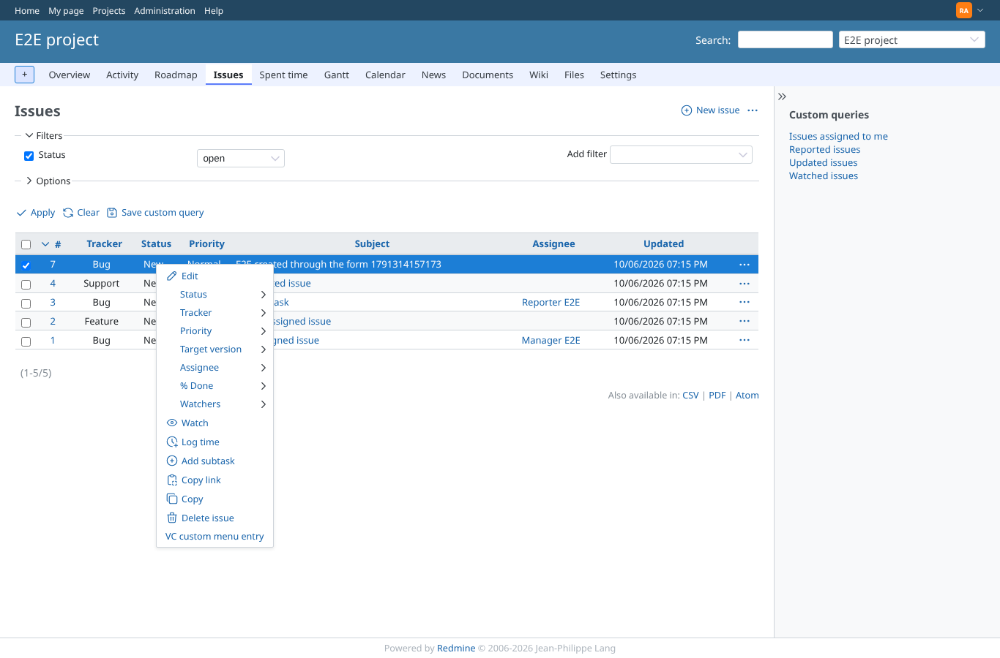
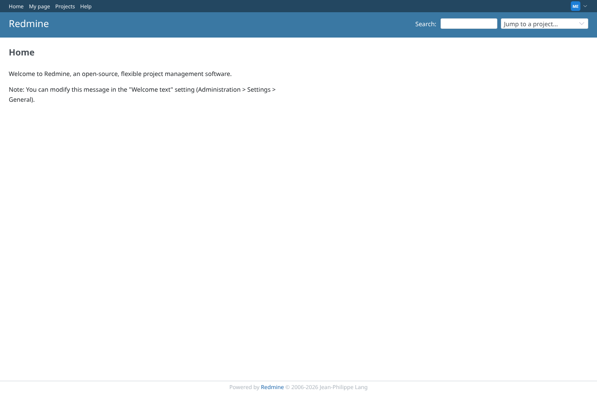
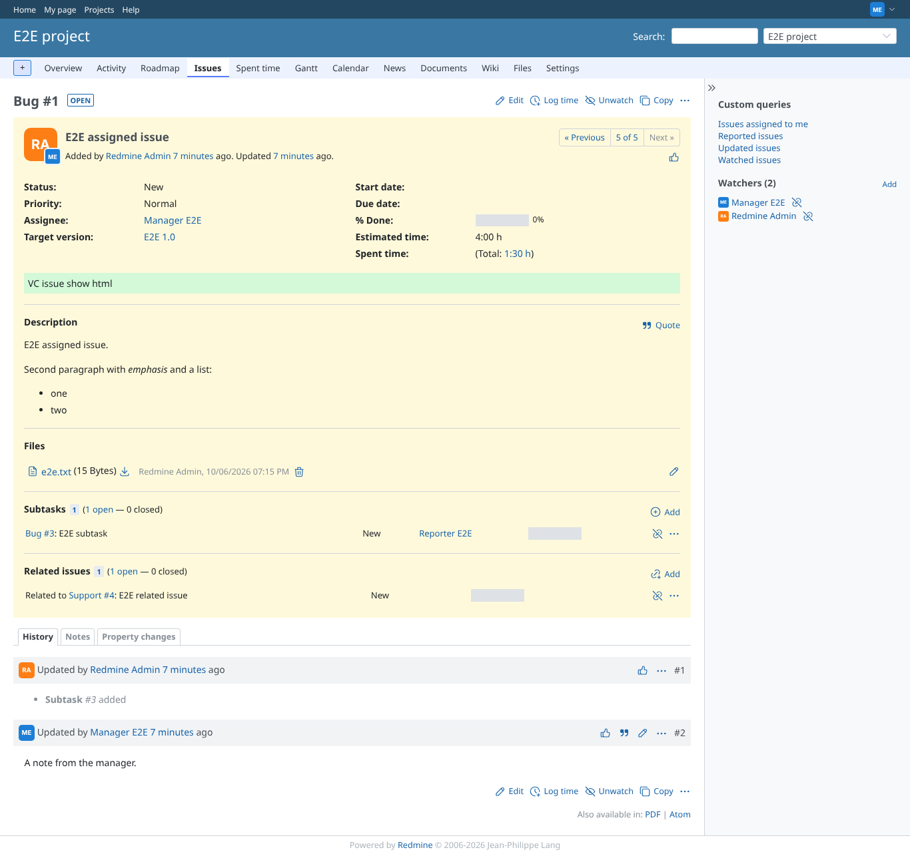
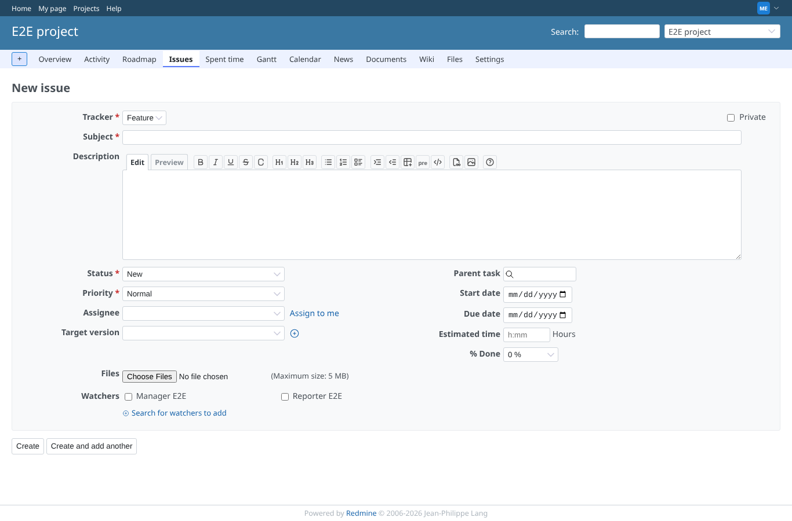
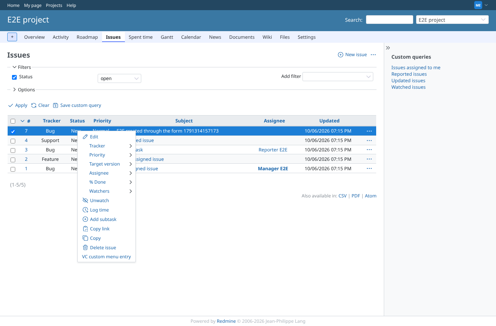
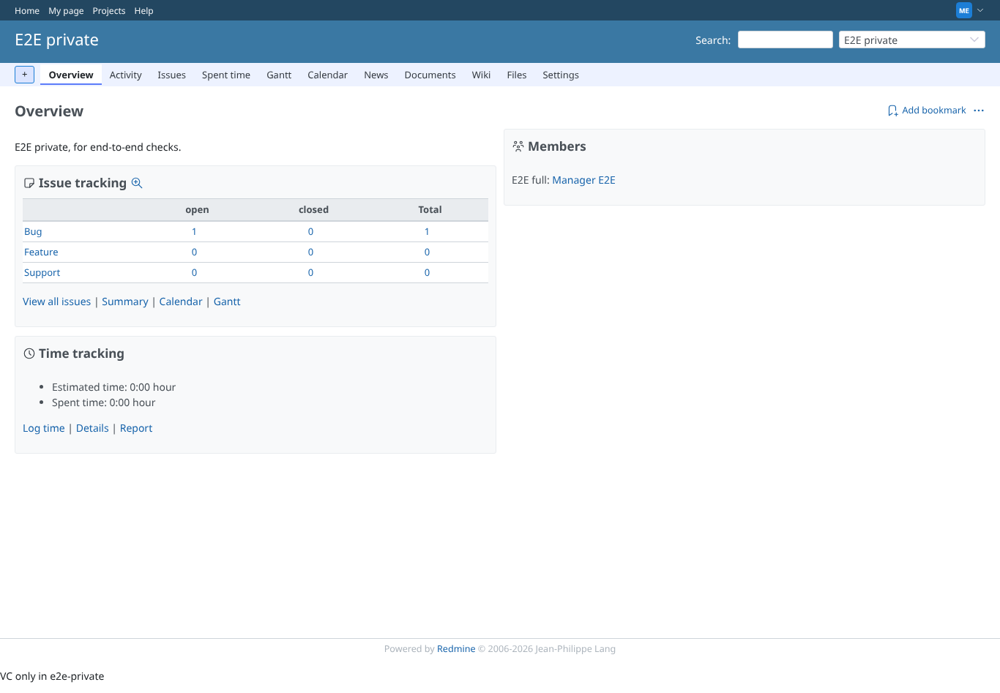

# insertion

Run 2026-10-06T19:22:36.800Z against http://127.0.0.1:3000.

| screenshot | user | URL | shows |
|---|---|---|---|
|  | admin | `/view_customizes` | The ten customizations used by this scenario |
|  | admin | `/` | admin: head and bottom code ran; the private one only for its author, the disabled one never |
|  | admin | `/issues/1` | admin: "bottom of issue detail" HTML is shown on the issue page |
|  | admin | `/projects/e2e-project/issues/new` | admin: form code ran at load and again after the tracker change (data-vc-form=2) |
|  | admin | `/projects/e2e-project/issues` | admin: the context menu ends with the customization's own entry |
|  | manager | `/` | manager: head and bottom code ran; the private one only for its author, the disabled one never |
|  | manager | `/issues/1` | manager: "bottom of issue detail" HTML is shown on the issue page |
|  | manager | `/projects/e2e-project/issues/new` | manager: form code ran at load and again after the tracker change (data-vc-form=2) |
|  | manager | `/projects/e2e-project/issues` | manager: the context menu ends with the customization's own entry |
|  | manager | `/projects/e2e-private` | manager: HTML bottom for ^e2e-private$ shows in that project |
|  | outsider | `/projects/e2e-private` | outsider: the private project is refused and shows no project-specific code |
|  | anonymous | `/login` | anonymous: global code runs on the login page too |
