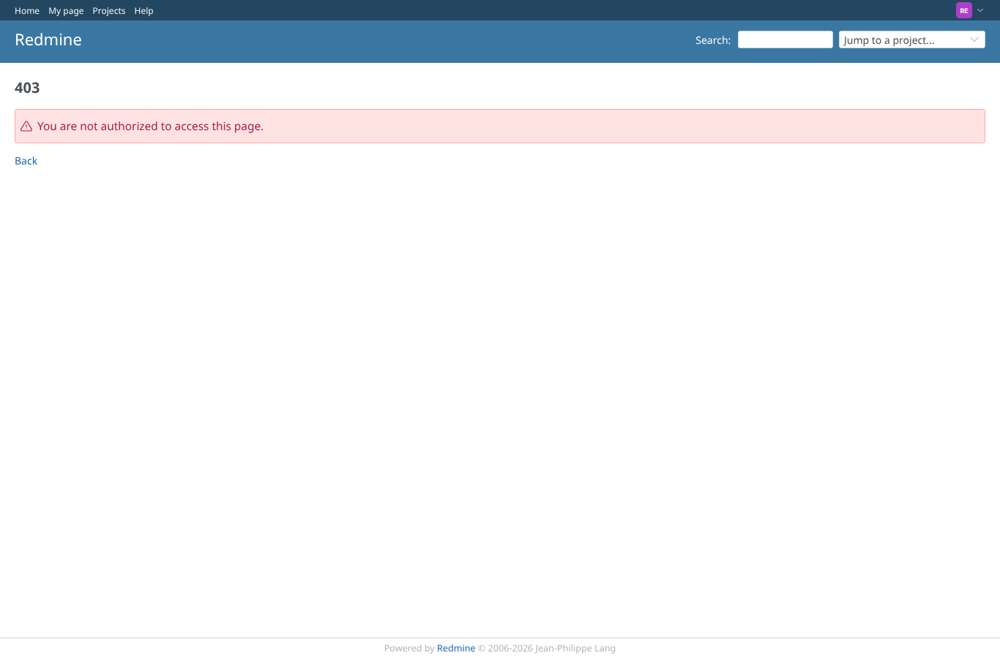
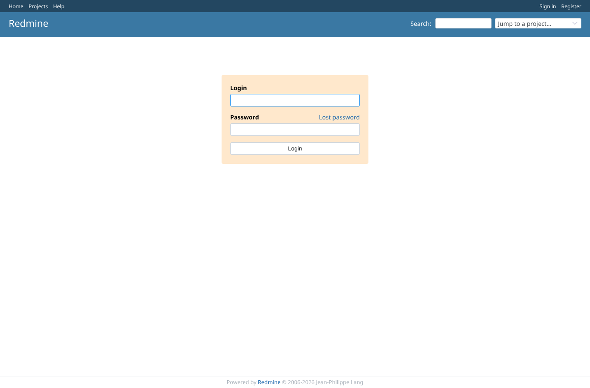
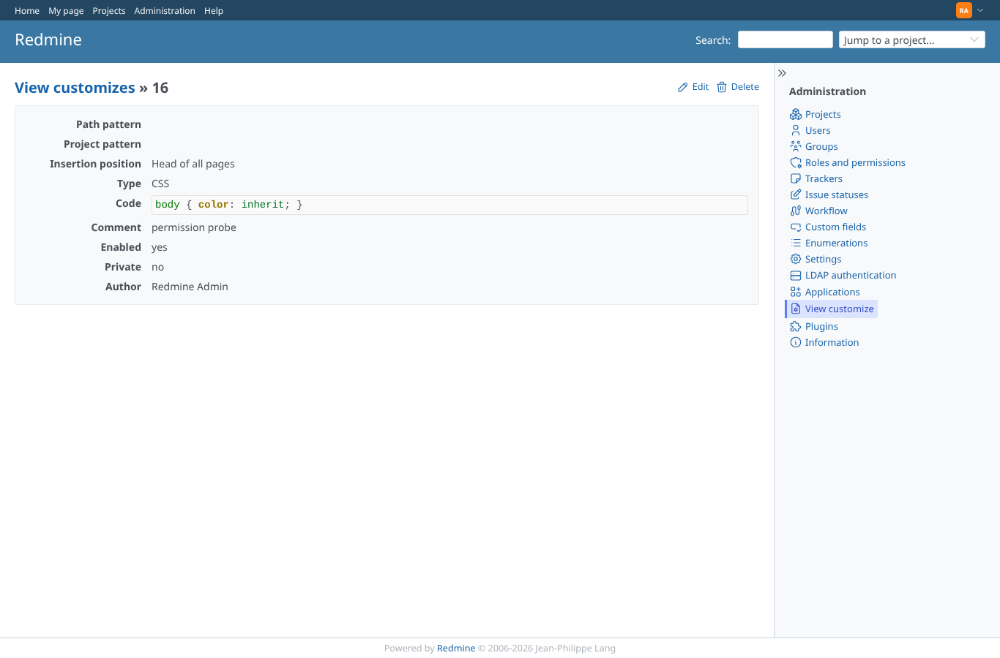

# permissions

Run 2026-10-07T16:06:06.297Z against http://127.0.0.1:3000.

| screenshot | user | URL | shows |
|---|---|---|---|
|  | admin | `/settings/plugin/view_customize` | admin: the plugin settings page with the API access key option |
|  | manager | `/settings/plugin/view_customize` | manager: /view_customizes is refused (403) |
|  | manager | `/settings/plugin/view_customize` | manager: the plugin settings page is refused (403) |
|  | reporter | `/settings/plugin/view_customize` | reporter: /view_customizes is refused (403) |
|  | reporter | `/settings/plugin/view_customize` | reporter: the plugin settings page is refused (403) |
|  | outsider | `/settings/plugin/view_customize` | outsider: /view_customizes is refused (403) |
|  | outsider | `/settings/plugin/view_customize` | outsider: the plugin settings page is refused (403) |
|  | anonymous | `/login?back_url=http%3A%2F%2F127.0.0.1%3A3000%2Fview_customizes%2F16` | anonymous: the plugin pages redirect to the login page |
|  | admin | `/view_customizes/16` | admin: the record is unchanged after all refused attempts |
